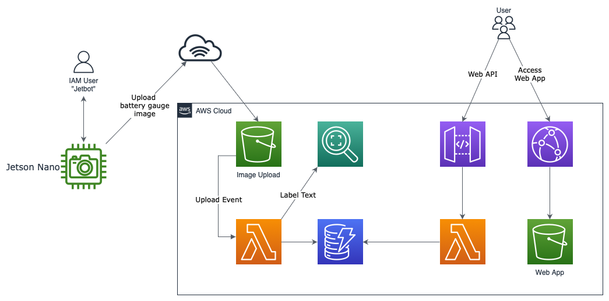

# Battery Monitor and Controller System

This solution provides the capability to monitor  and controller the charging of an electric motorcycle. 

AWS resources are created using cdk, except for IAM user for jetbot. User is created manually,to acquire access keys, which than need to be loaded onto the jetbot at `/.aws/config`.
 <!--
  * TODO: test adding IAM user generation to cdk
  * todo: add jetbot setup  
 -->

## Contents

-   [Architecture Overview](#architecture-overview)
-   [Deployment](#deployment)
-   [Source Code](#source-code) 
-   [Todo](#todo)
-   [Notes](#development-notes)

# Architecture Overview
Deploying this solution with the required parameters builds the following environment in the AWS
Cloud.
 


A [Jetbot](jetbot.org), from [SparkFun](https://www.sparkfun.com/products/18486),  provides image acquisition of the battery level on the motorcycle LCD. Image is uploaded directly to AWS S3 using IAM user credentials. 

It utilizes a nVidia Jetson to capture images of the LCD dash on a set interval (10 minutes). This image is upload to aws and stored in s3. The image is processed by reckognition with text labels and the results stored in a dynamo table. The solution provides a web UI that can be accessed with any browser. 

## CDK
Contains exclusively serverless items. s3 for image upload and web frontend hosting, cloudfront/route53 for https,  lambda for s3 upload event processing, rekognition for image to text processing, dynamoDB to store results. DynamoDB allows storing all of the results of rekognition, no current limit of the count of text labels saved.

# Source Code

Multiple components of this solution are:
  - Cdk IaC (root dir)
  - Remote camera capture (jetbot) in `remote-device/`
  - Web app in `front/web/`

 Source code for remote device is in `remote-device/` and contains a dockerfile, python script for uploading, and bash script for collecting images using gstreamer from the command line. Bash script is install as cron job and python script is configured as a daemon inside docker.

# Deployment

## AWS via CDK 

- Configure
```typescript
 new StaticSite(this, "static-web", { 
    domainName: "ABCDEFG.COM",
    siteSubDomain: "app",
    siteContents: "./front/web"
  });
```

- Deploy
```
cdk deploy --parameters RemoteDeviceIAMUserARN=arn:aws:iam::NNNNNNNNN:user/jetbot
```

## Web

Set endpoint in `app.js`
```javascript
const endpoint = "https://abcdefghij.execute-api.us-west-2.amazonaws.com/dev"
```

## Remote device setup

- Use `remote-device/setup.sh` to setup remote device
```bash
-e AWS_ACCESS_KEY_ID=XXX \
-e AWS_SECRET_ACCESS_KEY=YYY \
-e S3_BUCKET=ZZZ \
```


- Setup file system (RAM Disk)
```bash
mkdir /camera_captures
tmpfs  /camera_captures tmpfs                            rw,size=100M,uid=jetbot,gid=jetbot,mode=113   0    0
```

- Setup crontab
```
sudo service enable cron
0 0 0 0 0 /home/jetbot/nvidia-camera-capture/scripts/cron_camera_captures.sh
```

- Setup docker daemon to delay until filesystem mounted. Adjusting docker.service file
```
After= ... local-fs.target ...
```

- Create container that always runs upload script 
```bash
sudo docker run \
--restart=always \
--detach --tty \
--env PYTHONUNBUFFERED=1 \
--name=ubuntu_aws_nv_nano_upload \
--network=bridge \
--mount type=bind,src=/home/jetbot/nvidia-image-capture,dst=/home/nvidia-image-capture \
--mount type=bind,src=/camera_captures,dst=/camera_captures \
ubuntu_aws_nv_nano python3 /home/nvidia-image-capture/aws_upload_capture.py
```

# Todo
- Cdk static site setup has a small issue with cloudfront <--> S3 setup, requires manual adjust after deploy
- Expend cdk parameters
  - Domain
  - Certificate
  - Generate IAM User/role for jetbot
- Test AWS IoT Sdk
- Add live label generation by jetson nano

# Development Notes

## Lambda

  Typescript for cdk development has been great, but deploying typescript for lambda has been quite painful. I've gone through different processes for testing and deploying to lambda. 
  -  .zip'ing and uploading through aws cli
    - manual (or bash script) to transpile, zip, and aws cli upload
    - zips were around 10 - 20 MB
    - which forced me to create layers, loaded with aws-sdk and other dependencies
  - use cdk function `NodeJSFunction` which uses esbuild and uploads when cdk deploy is called. 
    - the transpiled javascript was unable to access the aws sdk that is preload into the lambda environment.
  - using SAM to test functions was mediocre 
    - using `sam local invoke` was ok but output can be extremely corrupted.

  <!-- TODO --> My take away is to try to use lambda with docker containers, a feature that was release in 2020 


Uses layers to resolve difficulties in importing @amw-sdk (v3).
Currently does not import the version that is provided by the runtime.  [github issue](https://github.com/aws/aws-sdk-js-v3/issues/3230)
<!--  todo: add layer to cdk. or not
    aws docs for cli publish-layer 
    https://aws.amazon.com/premiumsupport/knowledge-center/lambda-import-module-error-nodejs/
-->

Layers are no longer used since moving to `cdk.NodeJSFunction()` but the result is no longer debugable. 
<!-- TODO: inspect esbuild for options to change transpilation
     TODO: test excluding the aws-sdk
 -->

## Lambda - Testing using SAM
Uses SAM CLI to test lambda, with typescript being particularly difficult. Project layout was changed due to using the `cdk.NodeJSFunction()` which performs transpilation automatically.
To test:
```
cdk synth
cd cdk.out
sam local invoke imageupload808A8A81 -t BatteryMonitorStack.template.json --event ../lib/image-upload-s3-event.json --profile default --env-vars "../lib/env.json"
```

* `npm run build`   compile typescript to js
* `npm run watch`   watch for changes and compile
* `npm run test`    perform the jest unit tests
* `cdk deploy`      deploy this stack to your default AWS account/region
* `cdk diff`        compare deployed stack with current state
* `cdk synth`       emits the synthesized CloudFormation template
